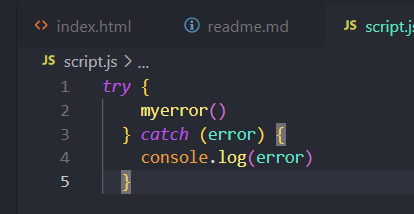
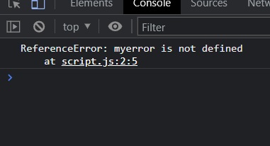
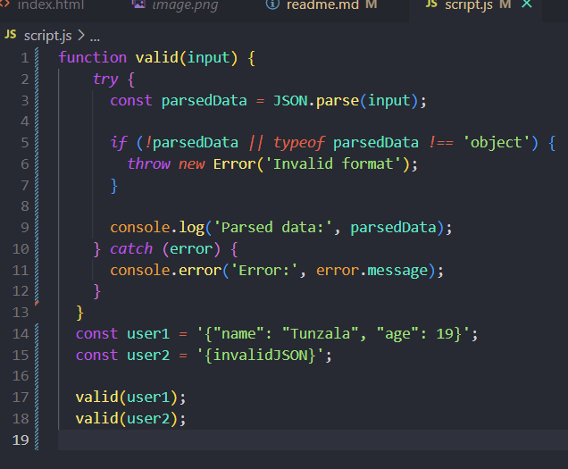
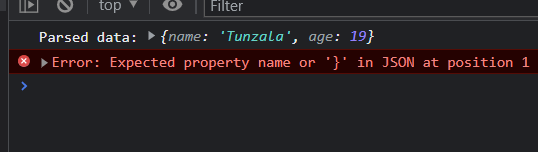

*Theoretical Question*
- Provide a few examples of when it is appropriate to use the try...catch construct in code.
- The code in the try block is executed first, and if it throws an exception, the code in the catch block will be executed.
- Mainly i use try...catch to handle an error. 
- 
- 
- Parsing and validating input:
- When parsing or validating user input, there might be cases where the input doesn't meet the expected format or requirements. In such problems, you can use try...catch to catch and handle those errors. For example, when parsing JSON data, you can use try...catch to handle potential parsing errors.
- 
- 
